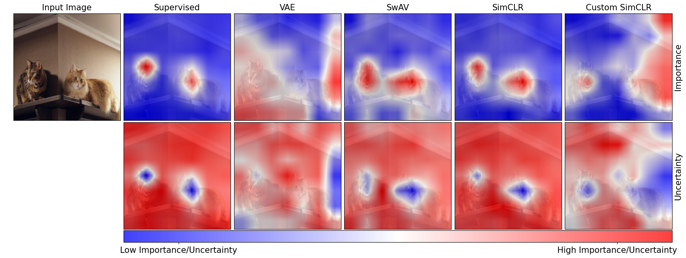

# Data Science Project - A Survey on XAI Methods for Self-Supervised Representation Learning

This repository contains the code and experiments written for our university project on the topic "A Survey on XAI Methods for Self-Supervised Representation Learning." The project explores various Explainable Artificial Intelligence (XAI) methods applied to self-supervised representation learning.

## Table of Contents

- `/src/xai/`: This directory contains the code written for the different identified XAI methods in our report and their corresponding experiments.

- `/src/xai/RELAX_and_LFFI/`: In this folder, you can find the implementations of the RELAX method and Label-Free Feature Importance (LFFI). The docstrings within the code provide a short example of how to use these methods. Additionally, there is the export of a iPython notebook (from Google Colab, with a link to run the notebook in Colab) where the quantitative and qualitative experiments were conducted.

- `/src/xai/cocoa/`: This directory includes the code written for the COCOA method. There is also an iPython notebook specifically dedicated to experiments related to COCOA.

- `/src/xai/embedded_gradcam/`: All the code for the GradCAM attribution method can be found in this folder.

-  `/src/xai/vdsn`: All the code for the VDSN attribution method can be found here.

- `/src/datasets/`: Some utility functions for loading the dataset

- `/src/visualization/`: Some utility functions used for some of the visualizations

- `/src/models/`: Some utility functions used for models. Most notably, the iPython notebook (exported from Kaggle) used to train our custom SimCLR model.

## How to Use

Each method's code and experiments are organized into separate directories for clarity and ease of use. To reproduce the experiments or utilize the XAI methods for your own purposes, you can navigate to the respective directories mentioned above and follow the instructions provided in the code files and iPython notebooks.

The Two4Two dataset used is unfortunately too large to upload to this repository, hence it needs to be downloaded separately locally. It can be downloaded [here](https://f002.backblazeb2.com/file/iclr2022/two4two_obj_color_and_spherical_finer_search_spherical_uniform_0.33_uniform_0.15.tar).

## Visualization

## Contributions

The code in this repository was developed as part of our "Data Science Project" course. The authors of this project are Denis Semko, Mert Akil and Jonas Klotz.

Thank you for visiting our repository!
